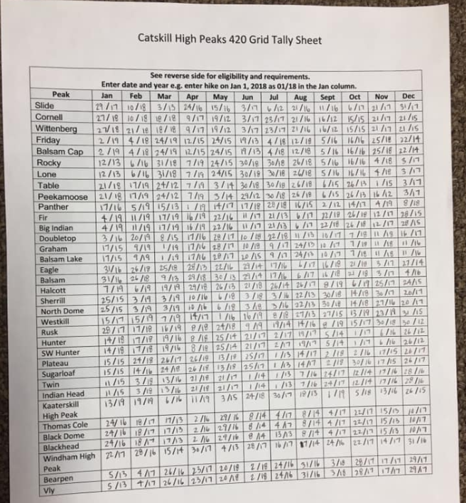
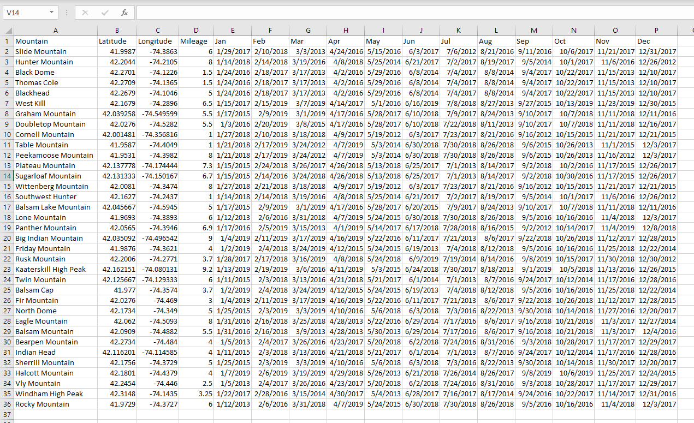
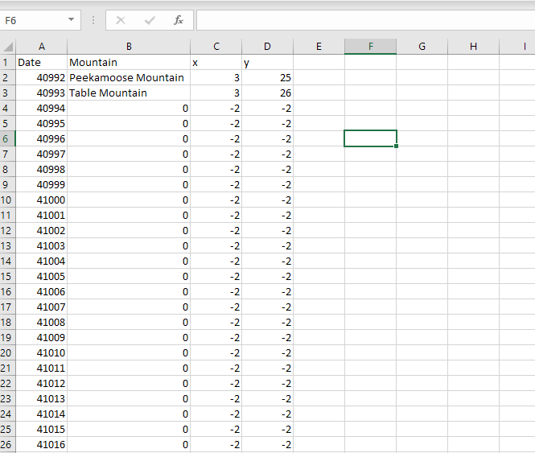

# Visualizing 420 Hikes Over 8 Years: The Catskills Grid

## Introduction

The Catskill Mountains of New York State are located about 100 miles north of New York City. Within the Catskills are 35 peaks above 3,500’ feet in elevation which are known as the Catskill High Peaks. Climbing all of the peaks is a popular challenge and there is even a [club](http://catskill-3500-club.org/) for those hikers who climb all 35 of the peaks. However, there exists an even more intense version of summiting all 35 of the peaks for those truly dedicated to hiking the Catskills: the Grid. To complete the Grid in the Catskills, one must hike all 35 peaks in each month of the year (note: it doesn’t have to be the same year) leading to a total number of peaks climbed of 420. To date, less than 50 people have accomplished this task. 

This year, my dad completed the grid after working on it for over 8 years. To commemorate his accomplishment, I put together a visualization of his hikes over those years. I’ve included my code in this repo for all of the analysis and visualization generation and will provide further explanation of how I created them in this readme. For those that are curious, the final video is [here.](https://www.youtube.com/watch?v=7lNpeh2Mh2s) The visualization is a video showing the hikes done by month and has three components: 1)  a map where a marker shows the peaks summited in that month 2) a line graph showing the cumulative miles hiked and 3) a ‘grid’ showing each peak and month that gets filled in over time. 

## Data Preparation

I started the process by collecting and cleaning the data of my dad’s hikes. The only data I had to work with (initially) was a photo of my dad’s grid tracking worksheet, which he filled in by hand. 
 

I used the photo to enter the dates for each hike into an Excel sheet which would become my master dataset. The next two steps were finding the coordinates for each mountain (latitude and longitude) for the map and the mileage to hike each one. I used a mixture of Google and Wikipedia for the coordinates and a couple websites to fill in the mileage for each mountain. 


I also needed to create one more Excel sheet for the visualization of filling in the grid. My original master would not work (unfortunately) with the method I chose to visualize the data so I had to create a new dataset. This dataset required a list of all the days in between when my dad began hiking and when he finished (2,801 days to be exact) and the “coordinates” of each mountain (mountain name and month) for that particular day. To complicated it further, each day could only hold one set of coordinates so it took a bit of manual data wrangling to get everything in place. The final result is here: 


You can find each of the final datasets, in CSV format, in this repo. Now we’re going to start our visualizations. 

## Visualziation 1: Map over Time 

Our first visualization is a map where a marker pops up on a peak if it was hiked in the current month being shown. I thought this would be the most difficult visualization of the three but it actually ended up being the easiest thanks to an awesome library called folium. This package leverages leaflet js, a mapping package for websites, to create maps with interactions. To make it even better, folium has a plugin where one can create time-series maps very easily – exactly what I needed! The plugin is called TimestampedGeoJson and requires a series of coordinates along with corresponding timestamps to create the visualization. With my master dataset from earlier, creating these datapoints was incredibly easy. Here is the code for this section: 

Importing our libraries (note: since this was a straightforward, one-off project I used one Jupyter notebook so will be showing all the requried imports - the code below won't make use of every library listed as it may pertain to other sections)
```python
import pandas as pd
import time
import datetime
import seaborn as sns
import folium
from folium.plugins import TimestampedGeoJson
import matplotlib
import matplotlib.pyplot as plt
import matplotlib.animation as animation
```

Now the real stuff: 
```python
#upload data from csv 
Catskills = pd.read_csv("CatskillsDataset_csv.csv")

months = ['Jan', 'Feb', 'Mar', 'Apr', 'May', 'Jun', 'Jul', 'Aug', 'Sep', 'Oct','Nov','Dec']
mountain_coordinates = []
mountain_time = []

date_range = pd.date_range('2012-03-24', periods=2801, freq='D')
dates_in_grid = pd.DataFrame({ 'Date': date_range, 'Mileage' : 0}) 
dates_in_grid.set_index('Date')

for i in range(len(Catskills)):
    for month in months: 
        # Start by creating a list of coordinates
        lat = Catskills.loc[i, 'Latitude']
        long = Catskills.loc[i, 'Longitude']
        coordinates = [long, lat]
        mountain_coordinates.append(coordinates)
        
        #Next we'll make a list of times 
        date_string = Catskills.loc[i, month]
        unix_time_for_hike = time.mktime(datetime.datetime.strptime(date_string, "%m/%d/%Y").timetuple()) * 1000
        #hike_time = convertTuple(unix_time_for_hike)
        mountain_time.append(unix_time_for_hike)
        
        #also going to create our full time-series dataset of day and mileage
        date_formatted = datetime.datetime.strptime(date_string, "%m/%d/%Y").strftime('%Y-%m-%d')
        dates_in_grid.loc[dates_in_grid['Date'] == date_formatted, ['Mileage']] = dates_in_grid.loc[dates_in_grid['Date'] == date_formatted, ['Mileage']] + Catskills.loc[i, 'Mileage']

mountain_data = pd.DataFrame(
    {'coordinates': mountain_coordinates,
     'time': mountain_time       
    })

mountain_data.sort_values(by=['time'], inplace=True)

#Create base Catskills map
m = folium.Map(
    location=[42.106020, -74.307206],
    zoom_start = 10,
    tiles='Stamen Terrain'
)

coordinates = mountain_data['coordinates']
times = mountain_data['time'] 

hike_list = []

for i in range(len(times)):
    hike = {
            'type': 'Feature',
            'geometry': {
            'type': 'Point',
            'coordinates': coordinates[i]
        },
        'properties': {
            'time': times[i]
    }}
        
    hike_list.append(hike)
    

TimestampedGeoJson(
    {'type': 'FeatureCollection', 'features': hike_list},
    period='P6D',
    duration='P1M',
    auto_play=True,
    loop=False,
    loop_button=True,
    date_options='MM/DD/YYYY',
).add_to(m)

# we can save our map directly as an html file 
m.save("CatskillsMap.html")
# the 'm' command will display our map directly in the notebook
m
```

## Visualization 2: Cumulative Miles Hiked

o	Next up was creating a line plot that shows the cumulative miles of all the hikes over time. To build this visualization, I used the animation function within matplotlib to show a steadily increasing line. Using the data from the master dataset was quite straightforward. Code shown here (note: data imports are included in the above section):

```python
#Create cumulative mileage column in our grid_dates dataframe 
dates_in_grid['CumMileage'] = dates_in_grid['Mileage'].cumsum()
dates_in_grid['Days'] = range(1,2802)

# this next set of code creates our cumulative mileage figure
fig = plt.figure()
ax = plt.axes(xlim=(0, 2805), ylim=(0,2300))
line, = ax.plot([], [], lw=3)

# setting the axis tick labels over time consisted of creating a proportional number (out of 2801) for each 'year' label
# so it looked correct on the map 
ax.set_xticks([0,305,670,1035,1400,1765,2131,2497])
ax.set_xticklabels(['2012','2013','2014','2015','2016','2017','2018','2019'])
plt.title("Cumulative Mileage While Hiking the Grid")
plt.xlabel("Year")
plt.ylabel("Miles")

# these functions create our actual animation 
def init():
    line.set_data([], [])
    return line,
def animate(i):
    x = dates_in_grid['Days'].iloc[:int(i+1)]
    y = dates_in_grid['CumMileage'].iloc[:int(i+1)]
    line.set_data(x, y)
    return line,

anim = animation.FuncAnimation(fig, animate, init_func=init,
                               frames=2801, interval=10, blit=True, repeat=False)

# this section saves our animation as a video
Writer = animation.writers['ffmpeg']
writer = Writer(fps=15, metadata=dict(artist='Me'), bitrate=1800)

anim.save('mileage.mp4',writer=writer)
```

## Visualization 3: Filling the Grid

o	For our last visualization I used the same technique (animated matplotlib) graph as I did with the cumulative mileage graph but instead used a scatter over a line graph. This would allow me to get the desired ‘look’ of a grid being filled in by datapoints. Using some marker styling and offsetting the datapoints in the grid, I was able to make it look like the grid was filling in rectangle by rectangle. The trickiest part of this section was building the dataset – each ‘day’ needed the coordinates (in the grid, not lat/long) of the mountains hiked. I did this manually in Excel as it did not have any patterns where code would be more efficient. Once this dataset was created, making the visualization was pretty simple, as the code here shows

```python
# this set of code creates our scatter plot of the grid filling in 

# remember, due to the difficulty of working with this data we created another csv in Excel
CatskillsScatter = pd.read_csv("CatskillsScatter.csv")

# setting up the coordinates list in a data frame (the -0.5 offsets the point to the correct place in the 'grid')
grids_list = []

for i in range(len(CatskillsScatter)):
    x = CatskillsScatter.iloc[i, 2] - 0.5
    y = CatskillsScatter.iloc[i, 3] - 0.5
    coordinate_list = [x,y]
    grids_list.append(coordinate_list)
    
# set up grid
a = range(0,13)
b = range(0,36)

# here we're creating a custom marker (rectangle)
v_val=1
h_val=3.2
verts = list(zip([-h_val,h_val,h_val,-h_val],[-v_val,-v_val,v_val,v_val]))

fig = plt.figure(figsize=(10,8))
ax = plt.axes(xlim=(0, 12), ylim=(0,35))
scat = ax.scatter([], [], s=2080, c='green', marker=verts)

# setting up the plot to be a 'grid'
ax.set_xticks([0,1,2,3,4,5,6,7,8,9,10,11,12])
ax.set_xticklabels(["",'Jan    ','Feb    ','Mar    ','Apr    ','May    ','Jun    ','Jul    ','Aug    ','Sep    ','Oct    ','Nov    ','Dec    ', ""])
plt.xticks(ha='right')
ax.set_yticks(b)
plt.yticks(va='bottom')
ax.set_yticklabels(Catskills['Mountain'].iloc[::-1])
plt.title("Catskills 3500' Grid")
plt.xlabel("Month")
plt.grid(b=True, which='both')

# we require a tight layout due to the long mountain names 
plt.tight_layout()

# our function for the scatter 
def init():
    scat.set_offsets([])
    return scat,
def animate(i):
    data = grids_list[:i+1]
    scat.set_offsets(data)
    return scat,

anim = animation.FuncAnimation(fig, animate, init_func=init,
                               frames=2805, interval=10, blit=True, repeat=False)

# again, saving the animation as a video file 
Writer = animation.writers['ffmpeg']
writer = Writer(fps=15, metadata=dict(artist='Me'), bitrate=1800)

anim.save('grid.mp4',writer=writer)
```

## Video Editing

The final step of this project was working with the videos of each visualization to show them at the same time. Much to my surprise, PowerPoint ended up working very well in this capacity. 

I first created a “timer” that would show the month and year as the visualization progressed by making a slide for each month and year of the total run. I then set the slides to transition automatically after 1 second as my entire runtime was 1 minute, 33 seconds (1 second per month). I then saved this PowerPoint as a mpeg video.

I made a new PowerPoint file with one slide where I placed all of the 4 separate videos (clock, map, mileage, grid) and set them all to play automatically with no delay. I had edited the speeds of all the videos to make sure they were all 1:33 long. With this prepwork done beforehand, all I needed to do was place the videos where I wanted them and crop them to the correct size. The “animations” allowed the videos to play automatically which made it so the entire video, with all 4 separate videos playing concurrently, was easily created by saving this presentation as a mpeg video. My work was done after uploading the final file to YouTube, visible here: [Hiking the Catskills Grid](https://www.youtube.com/watch?v=7lNpeh2Mh2s)
